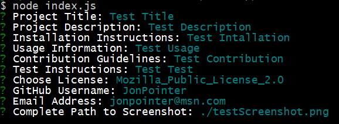

# README Generator

## Description

This repo is a Node.js application that builds a README file from the user's input. The user inputs items such as Project Title, Descriptions, License Choice, etc. and the application builds a formatted README file.

## Results

### Link to Screen Video Capture

[Screen Video Capture](https://drive.google.com/file/d/1_nJKKewLX-T0ENrA9Gok0UvDmv-16qbI/view)

### Link to a Sample Generated README

[Generated README](./Develop/README.md)

### Sample Input Screenshot

